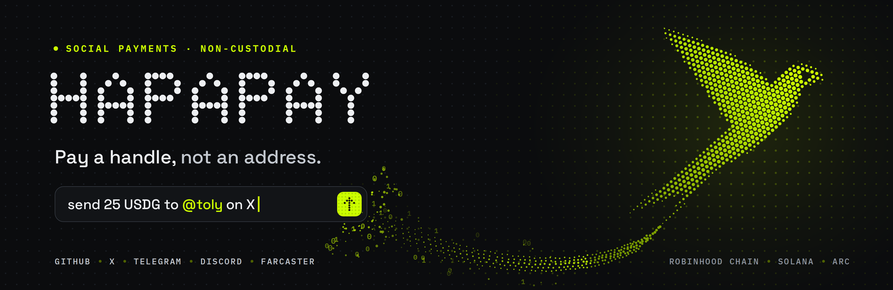
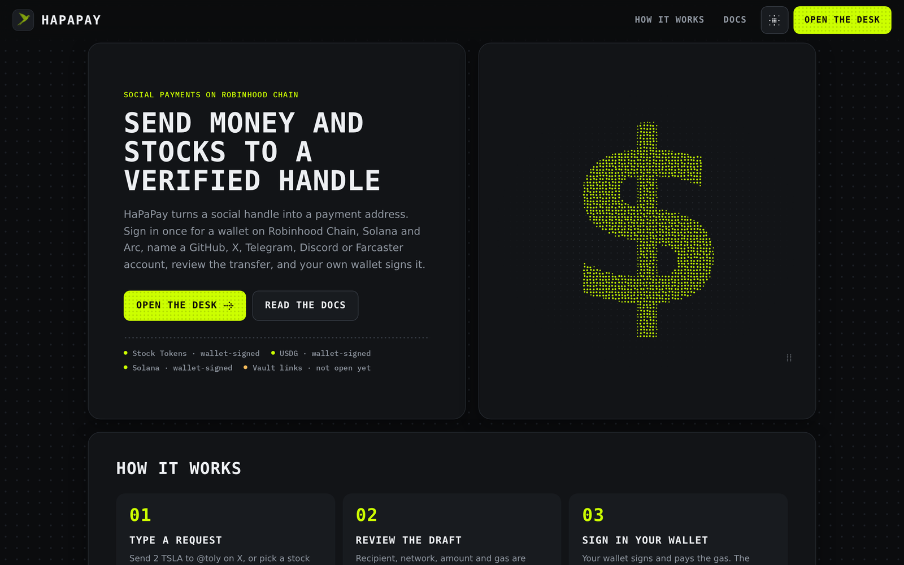
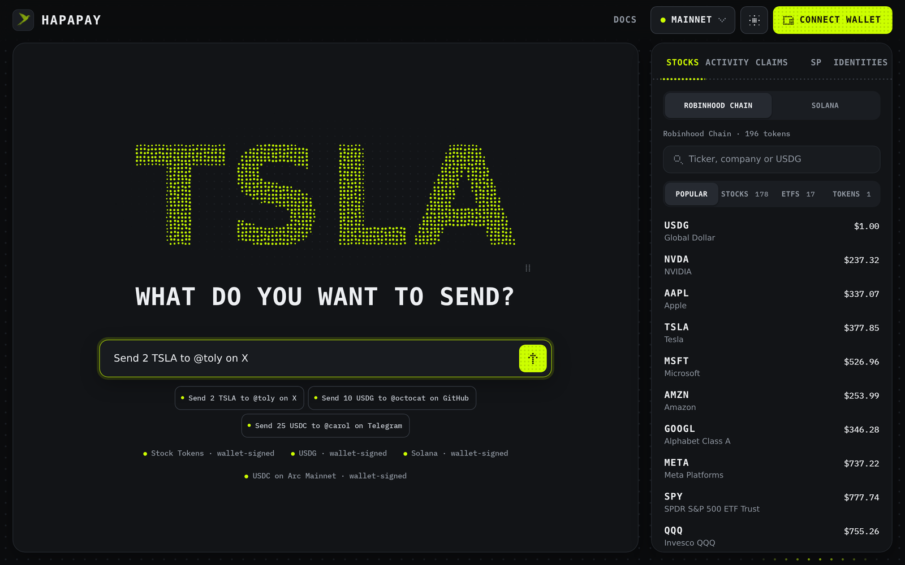
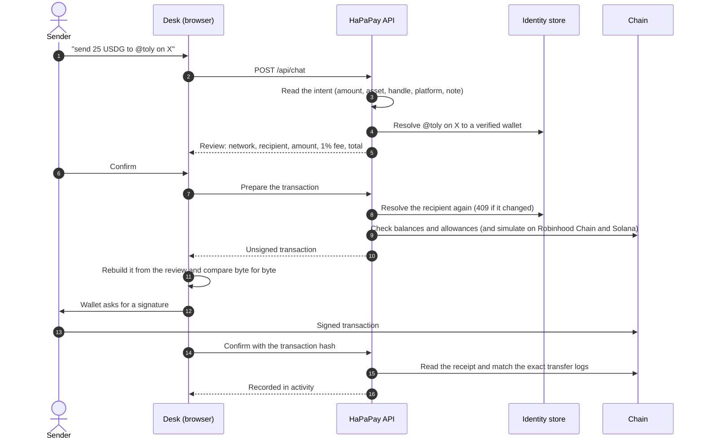
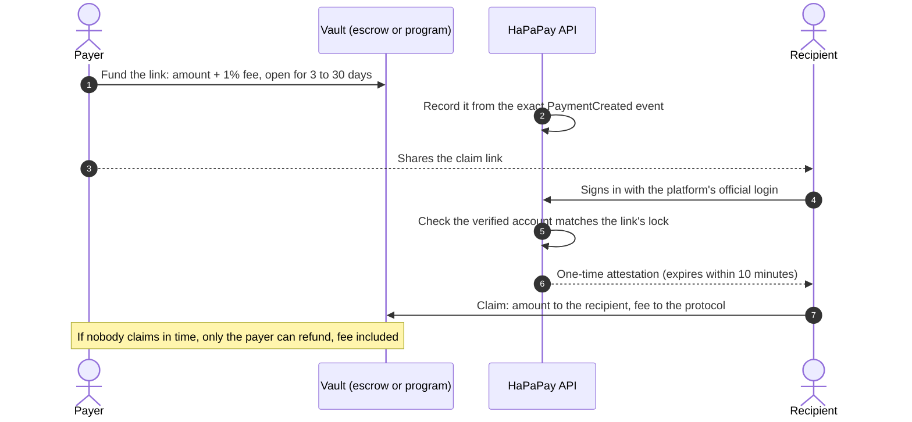
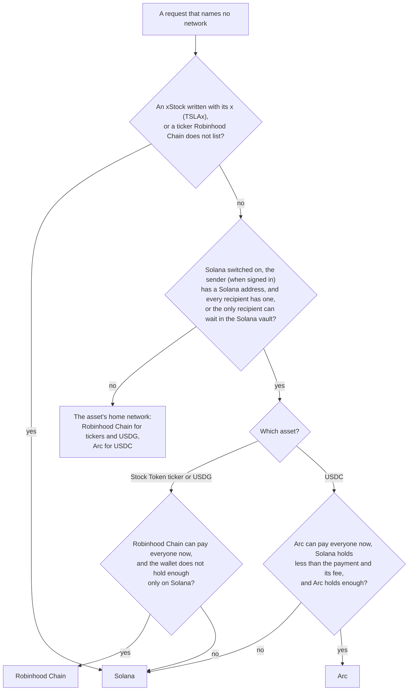
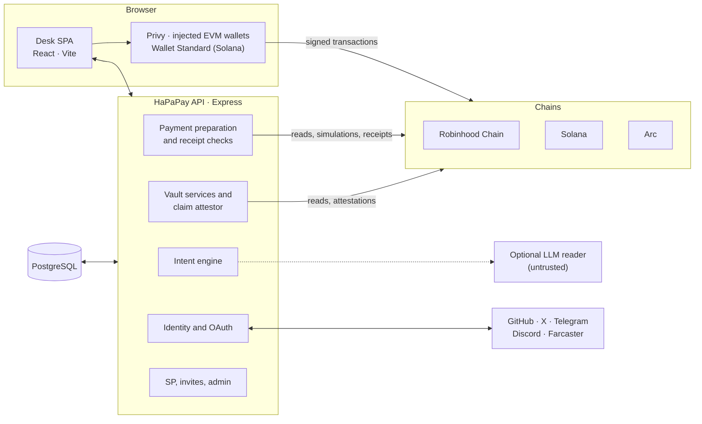

<p align="center">
  
</p>

<h1 align="center">HaPaPay</h1>

<p align="center">
  <b>Pay a handle, not an address.</b><br />
  Non-custodial social payments: send stablecoins, Robinhood Stock Tokens and xStocks to anyone's GitHub, X, Telegram,
  Discord or Farcaster handle, across Robinhood Chain, Solana and Arc. Your wallet signs every transfer.
</p>

<p align="center">
  <a href="https://github.com/furkan3152/HaPaPay/actions/workflows/ci.yml"></a>
  
  
  
  
  
  
  
  
</p>

<p align="center">
  <a href="#the-vision">Vision</a> ·
  <a href="#what-it-does">Features</a> ·
  <a href="#how-it-works">How it works</a> ·
  <a href="#architecture">Architecture</a> ·
  <a href="#getting-started">Getting started</a> ·
  <a href="#documentation">Docs</a>
</p>

---

## The vision

Money should move like a message. Everyone already has a name online: a GitHub handle, an X account, a Telegram
username. What they rarely have is a wallet address you can type from memory. Crypto still asks people to copy and
paste 42 characters, check the first four and the last four, and hope nobody swapped the middle.

HaPaPay turns a verified social handle into a payment address that works on more than one chain. You write what you
want in plain words, *"send 25 USDG to @toly on X"*, review exactly what will happen, and your own wallet signs it.

Four principles shape every part of it:

| | Principle | What it means in practice |
|---|---|---|
| **1** | **Identity is the address** | Handles are linked to wallets only through each platform's official sign-in. A typed name is never proof of anything. |
| **2** | **Your keys, your signature** | The server prepares and verifies transactions; it never holds your keys, never signs a transfer and never broadcasts one. |
| **3** | **Anyone can be paid** | Someone who has not joined yet can still receive money. It waits in an on-chain vault until they prove the handle is theirs, or it goes back to you. |
| **4** | **Verify, don't trust** | Every prepared transaction is checked in the browser against what you reviewed, and nothing is recorded until its receipt is read back from the chain. |

HaPaPay is not tied to one network. Each request runs where its asset lives, and where you hold it.

## What it does

<table>
  <tr>
    <td width="50%" valign="top">
      <h3>Pay by handle</h3>
      Send to verified accounts on <b>GitHub, X, Telegram, Discord and Farcaster</b>. One person or up to ten in one
      request, with an optional note written on chain.
    </td>
    <td width="50%" valign="top">
      <h3>Stablecoins and stocks</h3>
      <b>USDC</b> and <b>USDG</b>, <b>195 Robinhood Stock Tokens</b> on Robinhood Chain and <b>951 xStocks</b> on Solana,
      each pinned by address and read back from chain before it is listed.
    </td>
  </tr>
  <tr>
    <td valign="top">
      <h3>Plain-language requests</h3>
      A deterministic intent engine reads amounts, assets, handles, platforms and notes, in English and in Turkish.
      It asks when something is missing instead of guessing; an optional LLM reader is treated as untrusted input.
    </td>
    <td valign="top">
      <h3>Vault links</h3>
      Pay people who have not joined. Funds wait in an escrow contract or a Solana program and are claimed with a
      one-time attestation once the recipient verifies the account. Unclaimed links are refundable.
    </td>
  </tr>
  <tr>
    <td valign="top">
      <h3>Routing across chains</h3>
      The asset picks the network, and the sender's own holdings break ties: a request goes where the wallet can
      actually pay it, and the review says why.
    </td>
    <td valign="top">
      <h3>One sign-in</h3>
      Email, social login or an existing wallet through Privy gives one account with an EVM and a Solana address.
      Without Privy, injected EVM wallets and Wallet Standard Solana wallets work.
    </td>
  </tr>
  <tr>
    <td valign="top">
      <h3>Transparent fees</h3>
      A 1% fee, added on top and shown before signing; the recipient always gets exactly the amount written.
      The 1% rate and its split are constants in the contracts the operator registers; an owner can only lower it
      for holders of a token it names.
    </td>
    <td valign="top">
      <h3>Points, invites and an admin panel</h3>
      Social points (SP) for payments and claims verified on chain and for linking accounts, invite rewards, and an
      admin panel where every change, SP adjustments included, is signed by an admin wallet and logged first.
    </td>
  </tr>
</table>

<p align="center">
  
  
  <br />
  <sub>A local install. Vault links open once the operator registers a vault on a network.</sub>
</p>

## How it works

A payment is a conversation that ends in your wallet. The server reads and checks; your wallet signs; the chain is the
record.



### Paying someone who has not joined

When a handle has no verified wallet yet, the money can wait in a vault. A GitHub or Farcaster link waits for the
account's immutable ID, and so does an X link while the server can look X accounts up. Discord and Telegram, which
cannot be looked up by name, wait for the name (as X does without lookups) and accept only an account whose name was
confirmed after the link was made and, where the platform's IDs carry a creation time, an account older than the link.



### Choosing the network



Without a network written, a ticker only Robinhood Chain lists (such as COST) goes on Robinhood Chain. To choose a
network for an asset it carries, write it in the request itself and put any note or reason last (*"Send 5 USDC to @bob
on X on Arc for rent"*, *"Arc üzerinden @bob'a x'te 5 USDC gönder, kira için"*). Each draft is built for a network that
carries its asset, and every review names the network it uses and, when holdings decided it, how to ask for the other
one; check it before signing.

## Networks and assets

| Network | Assets | How a payment settles | Vault |
|---|---|---|---|
| **Robinhood Chain** (4663) | 195 Robinhood Stock Tokens (178 stocks, 17 ETFs), USDG | `approve` + `HaPaPayRouter.pay`: amount to the recipient, fee split in the same transaction | `StockClaimEscrow` |
| **Solana** (mainnet) | USDC, USDG, 951 xStocks | SPL Token and Token-2022 transfers plus the fee to the treasury in one transaction; batches split to fit | `hapapay-vault` program |
| **Arc** (Mainnet 5042, Testnet 5042002) | USDC | `approve` + `HaPaPayRouter.pay`, fee through `HaPaPayFeeForwarder` | `StockClaimEscrow` |

The fee contracts become part of a network when the operator registers its escrow: until then Robinhood Chain sends
plain transfers without a fee, and Arc Mainnet waits for them.

| Platform | Verified through |
|---|---|
| GitHub | OAuth |
| X | OAuth 2.0 with PKCE (S256) |
| Telegram | Log in with Telegram, HMAC-verified |
| Discord | OAuth (`identify`) |
| Farcaster | Sign in with Farcaster (nonce, domain, signature and FID checks) |

## Architecture



The browser never trusts the server blindly and the server never trusts the browser: prepared transactions are
rebuilt and compared in the browser before a wallet opens, and records are written only from receipts the server reads
itself. More in [docs/architecture.md](docs/architecture.md) and [docs/protocol.md](docs/protocol.md).

### Repository layout

```text
.
├── src/                      Desk (React SPA) and the domain rules shared with the server
│   ├── components/           Home, desk, docs, operator and admin pages; the dot-matrix UI kit
│   ├── domain/               Pure logic: intent parsing, assets, fees, vault locks, contract artifacts
│   └── wallet/               Privy and injected-wallet bridges
├── server/                   Express API: chat, identity, payments, vaults, receipts, SP, admin
├── contracts/                Solidity: StockClaimEscrow, HaPaPayRouter, HaPaPayBurnVault,
│                             HaPaPayFeeForwarder, ArcIdentityRegistry
├── foundry-test/             Forge unit, fuzz and invariant tests for the contracts
├── programs/hapapay-vault/   Solana vault program (Rust, native solana-program)
├── scripts/                  Allowlist sync, artifact generation, migrations, key setup
├── tests/                    Node test suite: API, services, lifecycles, UI rules
├── public/                   Static files and the pinned Solana program build
├── docs/                     Architecture, protocol, security, self-hosting, decisions
├── server.ts                 Serverless entry (Vercel)
└── Dockerfile                Container build
```

## Security at a glance

- **No custody.** The server prepares exact transactions, checks balances and allowances (and simulates on Robinhood
  Chain and Solana), and verifies receipts. The only thing it signs for the chain is a short-lived claim attestation for
  a vault link.
- **Byte-for-byte review.** The browser rebuilds every prepared call from the reviewed draft (network, token, sender,
  recipient, amount, fee, note) and refuses to open the wallet on any difference.
- **Verified identities only.** Accounts are linked through official OAuth, signatures or HMAC; one provider identity
  belongs to one wallet at a time, and a recipient is resolved again right before preparation.
- **Pinned assets and contracts.** Tokens are allowlisted by address and read back from chain; contracts and the
  Solana program are accepted only when their deployed code matches the committed artifacts.
- **Tested in depth.** 600+ Node tests (including Anvil lifecycles and an isolated PostgreSQL run), 56 Forge tests with
  fuzzing and an invariant suite, and Slither static analysis.
- **Not audited.** The contracts and the program have not had an independent audit. Start with small amounts.

Read the full model in [docs/security.md](docs/security.md). To report a vulnerability, see [SECURITY.md](SECURITY.md).

## Getting started

### Prerequisites

- Node.js 24 and npm
- PostgreSQL 16 for production (development runs on in-memory stores)
- Forge and Anvil come with `npm ci`; nothing else is needed for `npm test` and `npm run test:forge` (Forge downloads
  solc 0.8.28 on its first run)
- Optional: the Agave (Solana) tool suite for the program build and the validator tests, and pipx (with PyPI access)
  for `npm run test:slither`

### Run it locally

```bash
git clone https://github.com/furkan3152/HaPaPay.git
cd HaPaPay
npm ci
cp .env.example .env    # every value is optional in development
npm run dev             # desk on http://localhost:5173, API on http://localhost:8787
```

Without provider keys the desk still runs: networks and platforms that are not configured show as locked, with the
reason the server reports.

### Useful scripts

| Command | What it does |
|---|---|
| `npm run dev` | Vite and the API together (the desk hot-reloads; restart it for API changes) |
| `npm run check` | TypeScript project check |
| `npm test` | The Node test suite |
| `npm run test:forge` | Forge tests for the contracts (unit, fuzz, invariants) |
| `npm run test:slither` | Slither static analysis of the contracts |
| `npm run build` | Production build of the desk |
| `npm run migrate:database` | Apply the PostgreSQL migrations (explicit, never at request time) |
| `npm run sync:stock-tokens` | Rebuild the Robinhood Stock Token allowlist from the official registry and chain |
| `npm run sync:solana-stocks` | Rebuild the xStocks allowlist from the xStocks API and Solana |
| `npm run generate:stock-escrow` | Regenerate the contract artifacts from `contracts/` |
| `npm run build:solana-vault` | Build the Solana program and pin its size and hash |
| `npm run readiness` | Check the session secret, database, sign-in apps, Farcaster RPC and OpenRouter and X keys, and verify the Arc network and contracts on chain; missing settings are printed by name only |

To include the real-PostgreSQL suites, point the tests at an empty, disposable database:

```bash
REAL_DATABASE_URL=postgres://postgres@127.0.0.1:5432/postgres HAPAPAY_ISOLATED_POSTGRES=1 npm test
```

### Deploying

HaPaPay runs as a Vercel project (static desk on the CDN, the API as a function) or as a container (`Dockerfile`).
Production needs PostgreSQL, an HTTPS origin, a session secret of your own, an Optimism RPC for Sign in with
Farcaster, the OAuth apps you want, and the operator steps that deploy the contracts and the Solana program from
`/operator/stock-escrow`. The full checklist is in
[docs/self-hosting.md](docs/self-hosting.md).

## Documentation

| Document | Contents |
|---|---|
| [Architecture](docs/architecture.md) | Components, request lifecycle, intent engine, routing, identity, data model |
| [Protocol](docs/protocol.md) | Contracts, the Solana program, attestations, fees and their verification |
| [Security model](docs/security.md) | Trust boundaries, threats and controls, known limitations |
| [Self-hosting](docs/self-hosting.md) | Configuration, OAuth apps, database, operator setup, deployment |
| [Invariants](docs/invariants.md) | Rules every change must keep |
| [Design decisions](docs/decisions.md) | Why the system is built the way it is |
| [Design system](docs/design-system.md) | The dot-matrix interface and its rules |
| [Contributing](CONTRIBUTING.md) | Workflow, tests and conventions |

The desk also serves its own user and operator guide at `/docs`.

## Disclaimer

HaPaPay is an independent project. It is not affiliated with, endorsed by, or officially connected with Robinhood
Markets, Inc., the Solana Foundation, the xStocks issuer, Paxos, Circle, Arc, Privy or any social platform it supports.

Robinhood Stock Tokens and xStocks give economic exposure, not ownership of the underlying shares. They are not for
U.S. persons, and other regional restrictions apply; the eligibility statements HaPaPay asks for are self-attestations,
not a legal review. Nothing here is financial advice. The software is provided as is, without warranty, and its
contracts are unaudited.
