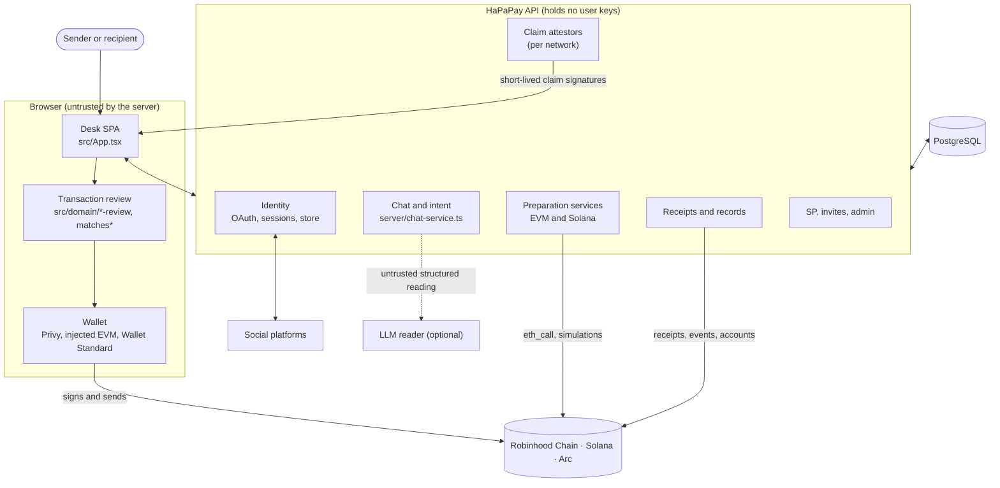
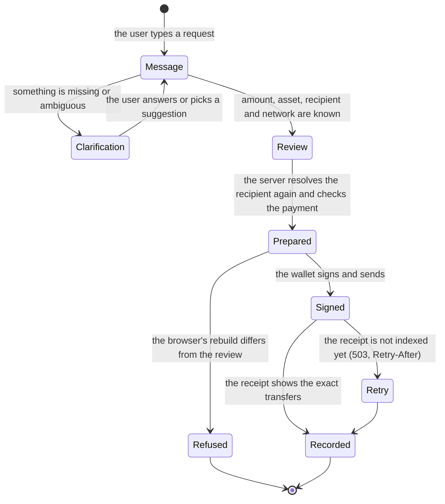
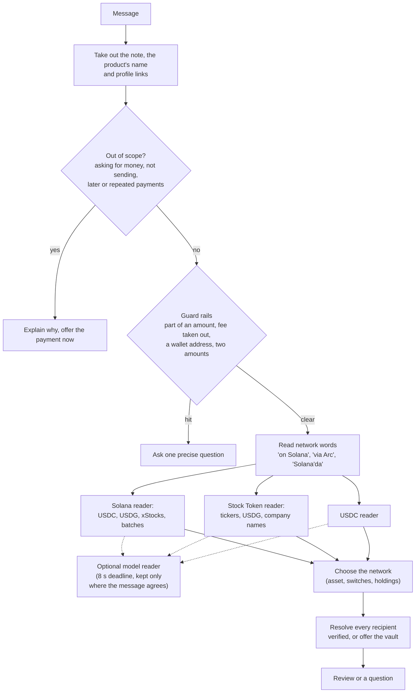
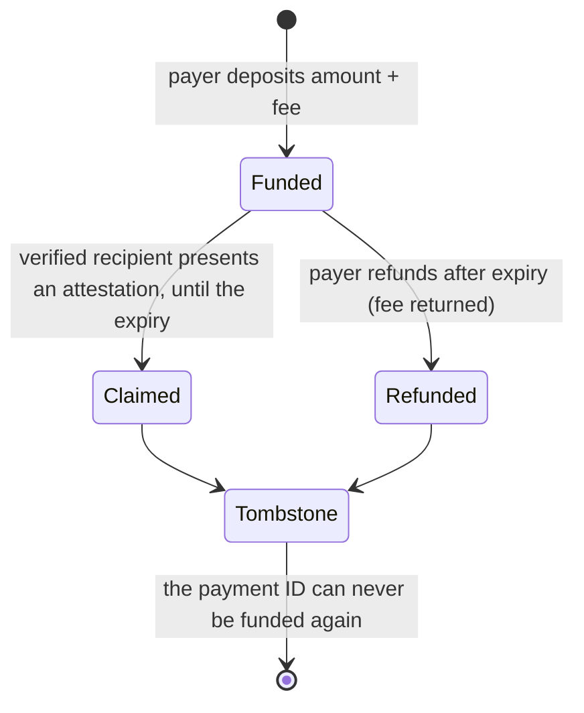
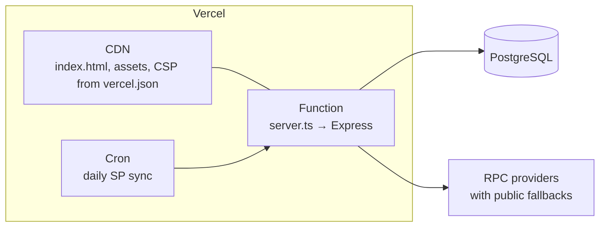

# Architecture

HaPaPay is a single TypeScript codebase with three parts that share one set of domain rules:

- **The desk**, a React single-page app that reads requests, shows reviews and asks the user's wallet to sign.
- **The API**, an Express server that understands requests, resolves verified identities, prepares exact
  transactions, and records payments only from receipts it reads itself.
- **On-chain components**: EVM contracts on Robinhood Chain and Arc, and a native program on Solana (see
  [protocol.md](protocol.md)).

`src/domain/` holds pure logic used by both the browser and the server: request parsing, asset allowlists, fee math,
vault locks, contract artifacts and the byte-for-byte transaction checks. The browser re-runs those checks on
everything the server returns.

## System context

Two boundaries matter most:

1. **The wallet boundary.** Only the user's wallet signs payments, vault deposits, claims and refunds. The only keys the
   server signs anything for a chain with are claim attestors, which can authorize a vault payout to a verified
   recipient and nothing else. It also holds the Arc identity registry's attestor keys, only to derive that registry's
   verifier address.
2. **The review boundary.** The browser accepts a prepared transaction only when it rebuilds the same bytes from the
   draft the user reviewed. The server accepts a payment only when the chain shows the exact transfers.

## Server modules

| Area | Modules | Responsibility |
|---|---|---|
| HTTP surface | `server/app.ts`, `server/index.ts`, `server.ts` | Routes, security headers, rate limits, ingress guard, wiring of services |
| Configuration | `server/runtime-config.ts`, `server/environment.ts`, `server/readiness.ts` | Reads settings, verifies chains and contracts at boot, reports what is missing by name |
| Requests | `server/chat-service.ts`, `server/openrouter.ts` | Intent engine, clarifications, routing, the optional LLM reader |
| Identity | `server/social-providers.ts`, `server/oauth-flow-store.ts`, `server/farcaster-auth-service.ts`, `server/wallet-auth.ts`, `server/verified-identity-service.ts`, `server/identity-store.ts`, `server/postgres-identity-repository.ts`, `server/account-address-service.ts` | Official sign-ins, wallet sessions (SIWE), the account's Solana address, identity resolution |
| Recipient lookup | `server/recipient-discovery.ts`, `server/vault-recipient.ts` | Asking GitHub, X and the Farcaster registry whether a handle exists, and what a vault link waits for |
| EVM payments | `server/stock-transfer-service.ts`, `server/payment-history-service.ts`, `server/robinhood-network.ts`, `server/arc-network.ts` | Exact calldata, a simulation on Robinhood Chain and balance and allowance checks on Arc, receipt matching |
| EVM vaults | `server/stock-claim-service.ts`, `server/claimable-payment-service.ts`, `server/claim-funding-service.ts`, `server/claim-redemption-service.ts`, `server/fee-verification.ts` | Escrow registration, funding records, claim attestations, refunds, fee contract checks |
| Solana | `server/solana-network.ts`, `server/solana-routes.ts`, `server/solana-transfer-service.ts`, `server/solana-vault-service.ts`, `server/solana-market.ts` | Transfers, the vault program, holdings and prices on Solana |
| Settlement | `server/vault-settlement.ts`, `server/receipts.ts` | Reading whether links were claimed or refunded; receipts for the desk's waits |
| Points and admin | `server/sp-service.ts`, `server/sp-activity.ts`, `server/sp-routes.ts`, `server/referral-store.ts`, `server/referral-payouts.ts`, `server/admin-service.ts`, `server/admin-routes.ts`, `server/admin-records.ts` | SP ledger, invites and payouts, signed admin actions, audit log |
| Storage | `server/database.ts`, `server/append-only.ts`, `server/transient-state-store.ts` | Migrations, the boot-time schema check, append-only triggers, short-lived shared state |

## The life of a request

A review is a description, never a transaction. Nothing reaches a wallet until the user confirms the review, the
server prepares it again with fresh data, and the browser accepts the prepared bytes.

## The intent engine

Requests are read deterministically first. The optional model reader (OpenRouter, with an eight-second deadline) is
asked only when the rules find no recipient for a Stock Token or Solana request, or for a USDC request that states one
amount and USDC or dollars. Those messages leave the server for a third party, and the model's reading is kept only
where every handle, platform, amount and asset it returns is written in the message itself.

What it reads:

- **Amounts** in digits or words, in English and Turkish (`25`, `.5`, `10k`, `twenty-five`, `yirmi beş`, `2,5 bin`).
  An amount that reads two ways (`1,000`) is asked about, never guessed.
- **Recipients** with or without `@`, in common phrasings (`pay octocat 5 USDG on GitHub`, `octocat'a`), and the
  platform named after the handle, before it, or as the only platform in the request. A platform written as the
  sender's own account (`from my GitHub`, `GitHub hesabımdan`) is never taken for the recipient's.
- **Batches** of up to ten people with one amount each (`each`, `her birine`), split (`split`, `toplam`), or an amount
  written next to each person (`10 USDC to @a and 5 USDC to @b`).
- **Notes** after a marker (`note:`, `memo:`, `not:`) or a closing `for …`, up to 140 characters, written on chain.

What it refuses to guess: a second asset, a dollar value of a stock, a part of an amount, a fee taken out of the
amount, a network HaPaPay does not run, a wallet address in place of a handle, and anyone the request says not to pay.
Each gets one question, often with up to three complete requests to pick from, which are read again from scratch.

## Network routing

Each asset has a home: Stock Tokens and USDG on Robinhood Chain, xStocks on Solana, USDC on Solana or Arc. When a
request names no network and the sender is signed in, the server reads the sender's own balances (2.5 seconds per
read) to choose between homes: a request goes where the wallet holds the amount plus the 1% fee. Balances only
choose; preparation reads them again, and nobody else's balance is ever read. The review states the choice and, when
holdings decided it, how to ask for the other network.

## Identity

| Concept | Rule |
|---|---|
| **Account** | An EVM wallet, proven by a Sign-In with Ethereum (EIP-4361) message for the site's domain, valid five minutes and once. The session is a signed, HttpOnly cookie that lasts 30 days from the signature. |
| **Solana address** | One per account, added only after that Solana wallet signs a one-time message naming the domain, the account and the address, and within ten minutes of the account's own sign-in or with a fresh account signature. |
| **Linked account** | A GitHub, X, Telegram, Discord or Farcaster account proven by the platform's official flow. One provider identity belongs to one wallet at a time, and one handle to one provider identity. |
| **Resolution** | Payments resolve a handle to its account's wallet (or Solana address) from the database, again right before preparation; a change since the review answers `409`. |

Accounts are removed only by a fresh sign-in that proves a handle moved, or by the wallet's own removal; an expired
session, a failed read or a release removes nothing.

## Vault links

A vault link is money for someone who has not joined. It lives in `StockClaimEscrow` on Robinhood Chain and Arc, and
in the `hapapay-vault` program on Solana, and waits for one of two locks (`src/domain/vault-lock.ts`):

- **Account lock** for GitHub, X and Farcaster: the handle is resolved through the official source to an immutable
  account ID before funding.
- **Name lock** for Discord and Telegram, and for X while X does not answer lookups: the link waits for `name:<handle>`.
  It can be claimed only by an account whose platform confirmed that name at a sign-in after the link was made; on
  Discord and X the account must also be older than the link, read from its snowflake ID.

The server records a link only from the exact `PaymentCreated` event (or the program account on Solana). A funding
the browser could not record is kept in that browser and sent again after the next sign-in, so a funded link is never
left unrecorded. Pending claims are listed per wallet by reading every candidate back from its escrow or program.

## Data model

All state that matters lives on chain; PostgreSQL holds identities, records of verified transactions and the points
system. Tables are created by explicit migrations (`npm run migrate:database`); a production server checks them
read-only at boot, and only a development server applies them itself.

| Group | Tables | Notes |
|---|---|---|
| Identity | `social_identities`, `account_addresses` | One provider identity per wallet; one Solana address per account |
| EVM records | `arc_payments`, `claim_fundings`, `stock_transfers`, `stock_claim_escrows`, `stock_claims` | Keyed by chain and transaction or payment ID; replays answer `409` |
| Solana records | `solana_transfers`, `solana_vaults`, `solana_claims` | One row per payment, keyed by signature and index |
| Points | `sp_rules`, `sp_ledger`, `sp_account_flags` | Append-only rules and ledger; the balance is the sum of ledger rows |
| Invites | `sp_referral_codes`, `sp_referrals`, `referral_fee_rewards`, `referral_payout_batches`, `referral_fee_payouts` | Append-only; rewards come from fees verified on chain |
| Admin | `admin_audit_log`, `admin_settings` | Every change is signed and logged before it runs |
| Runtime | `transient_security_states` | OAuth flows, challenges and short pauses shared across instances |

Append-only tables carry triggers that refuse `UPDATE`, `DELETE` and `TRUNCATE`; corrections are new rows.

## API surface

| Area | Routes |
|---|---|
| Status | `GET /api/health`, `GET /api/providers`, `GET /api/network` |
| Session | `POST /api/auth/challenge`, `POST /api/auth/verify`, `POST /api/auth/logout`, `GET /api/me`, `GET /api/profile` |
| Accounts | `GET /api/oauth/{github,x,discord}/start` and `/callback`, `POST /api/oauth/telegram/verify`, `POST /api/oauth/farcaster/start` and `/complete`, `DELETE /api/identity/:platform`, `POST /api/auth/solana/challenge` and `/verify`, `DELETE /api/auth/solana` |
| Requests | `POST /api/chat`, `GET /api/resolve/:platform/:username` |
| Arc USDC | `POST /api/payment/prepare`, `POST /api/payment/prepare-batch`, `POST /api/payments/confirm`, `GET /api/payments`, `POST /api/claims/prepare`, `POST /api/claims/confirm-funding`, `GET /api/claims/:paymentId`, `POST /api/claims/:paymentId/prepare-{claim,refund}` |
| Robinhood Chain | `GET /api/stocks`, `POST /api/stocks/transfers/prepare`, `POST /api/stocks/transfers/prepare-batch`, `POST /api/stocks/transfers/confirm`, `GET /api/stocks/transfers`, `POST /api/stocks/claims/prepare`, `POST /api/stocks/claims/confirm-funding`, `GET /api/stocks/claims/:network/:paymentId`, `POST /api/stocks/claims/:network/:paymentId/prepare-{claim,refund}` |
| Solana | `GET /api/solana`, `GET /api/solana/assets`, `GET /api/solana/holdings`, `POST /api/solana/transfers/prepare`, `POST /api/solana/transfers/confirm`, `GET /api/solana/transfers`, `POST /api/solana/claims/prepare`, `POST /api/solana/claims/confirm`, `GET /api/solana/claims/:paymentId`, `POST /api/solana/claims/:paymentId/prepare-{claim,refund}` |
| Vaults | `GET /api/claims/pending`, `GET /api/receipts/:chain/:hash` |
| Operator | `GET /api/stocks/escrow`, `POST /api/stocks/escrow/register`, `GET /api/solana/vault`, `POST /api/solana/vault/register`, `POST /api/solana/vault/retire`, `GET /api/arc/mainnet-setup`, `GET /api/arc/mainnet-setup/deployment`, `GET /api/arc/mainnet-setup/receipt/:hash`, `POST /api/arc/mainnet-setup/verify` |
| Points | `GET /api/sp`, `GET /api/sp/history`, `GET /api/sp/rules`, `POST /api/sp/claims`, `GET /api/sp/referral`, `POST /api/sp/referral`, `GET /api/cron/sp-sync` |
| Admin | `GET /api/admin/{me,overview,activity,audit,referrals}`, `GET /api/admin/sp/{rules,ledger,leaderboard}`, `GET /api/admin/accounts/:query`, `GET /api/admin/export/:table`, `POST /api/admin/challenge`, `POST /api/admin/actions`, `POST /api/admin/referrals/payouts`, `POST /api/admin/referrals/payouts/:batch` |

Every route that prepares or records requires a wallet session, is rate-limited per client and is never shared-cached.
Error responses carry fixed messages: provider, database and RPC error text never reaches the browser.

## Runtime topology

- **Vercel**: the desk is served from the CDN with its security headers; `/api/*` runs in one function. Requests
  never change the schema: migrations run explicitly before traffic, and a missing or incompatible schema answers a
  generic `503`.
- **Docker**: the same server serves the built desk and the API on port 8787, with a health check on `/api/health`.
- **RPCs**: each network may point the server at a provider (which can carry a key and is never sent to a browser),
  falling back to the public endpoint. Every network is verified at boot by chain ID or genesis hash; a failing
  network turns only its own features off.
