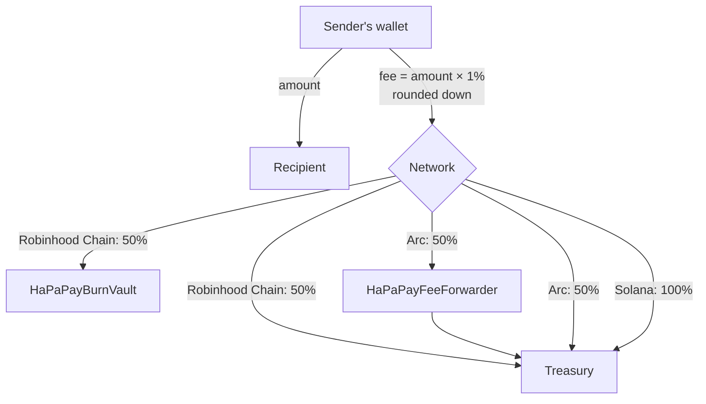
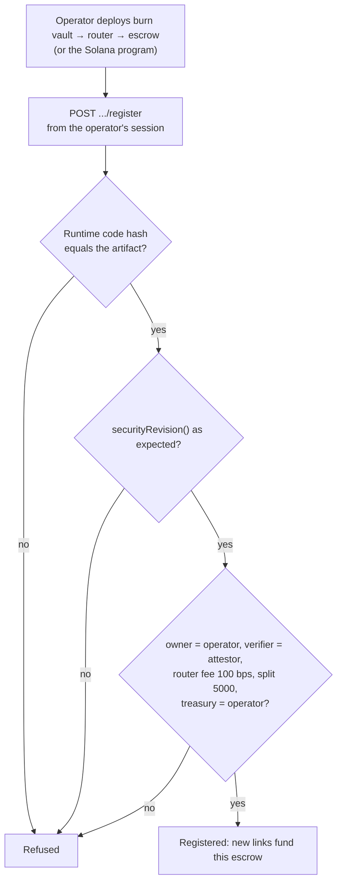

# Protocol

The on-chain side of HaPaPay is small on purpose: a fee router, a vault escrow and two fee sinks on the EVM networks,
and one native program on Solana. None of them knows about social platforms. They know payments, identity keys and
signatures from a configured attestor; the meaning of a handle stays off chain, where the official sign-ins are.

| Component | Language | Networks | Security revision | Role |
|---|---|---|---|---|
| [`HaPaPayRouter`](../contracts/HaPaPayRouter.sol) | Solidity 0.8.28 | Robinhood Chain, Arc | 1 | Direct payments with the 1% fee in the same transaction |
| [`StockClaimEscrow`](../contracts/StockClaimEscrow.sol) | Solidity 0.8.28 | Robinhood Chain, Arc | 2 | Vault links: hold a payment for an identity key until a verified claim or a refund |
| [`HaPaPayBurnVault`](../contracts/HaPaPayBurnVault.sol) | Solidity 0.8.28 | Robinhood Chain | 1 | Receives the burn half of fees; can only buy and burn one token |
| [`HaPaPayFeeForwarder`](../contracts/HaPaPayFeeForwarder.sol) | Solidity 0.8.28 | Arc | 1 | Stands in for the burn vault; can only forward to the treasury |
| [`ArcIdentityRegistry`](../contracts/ArcIdentityRegistry.sol) | Solidity 0.8.28 | Arc | 2 | Legacy on-chain identity registry, verified as part of Arc's contract set |
| [`hapapay-vault`](../programs/hapapay-vault/src/lib.rs) | Rust, `solana-program` 2.3 | Solana | 1 | The Solana counterpart of `StockClaimEscrow` |

All contracts compile with solc 0.8.28, optimizer at 200 runs, EVM `cancun`. No contract keeps a setting in an
`immutable`, so every deployment of a contract has the same runtime code, and the server can pin it by hash.

## Fees



- The fee is `FEE_BPS = 100` basis points of the amount, **added on top**: the recipient always receives exactly the
  amount written, and the review shows the fee and the total before anything is signed.
- `BURN_SHARE_BPS = 5000`: half of each fee (rounded down) goes to the burn vault, the rest to the treasury.
- A vault link holds its fee with the amount. The fee is paid out only on a claim and returned with a refund.
- Fees round down, so a payment of a few base units can carry none.
- The router supports an optional holder rate (`setPass`): holders of a minimum balance of one token pay a lower rate,
  never above 1%. It is off until an owner turns it on, and the token can be set only once.

## HaPaPayRouter

```solidity
function pay(address token, address recipient, uint256 amount, bytes32 paymentRef) external returns (uint256 fee);
function feeFor(address payer, uint256 amount) external view returns (uint256);
function splitFee(uint256 fee) external pure returns (uint256 burnShare, uint256 treasuryShare);
event Paid(bytes32 indexed paymentRef, address indexed payer, address indexed recipient,
           address token, uint256 amount, uint256 fee, uint256 burnShare, uint256 treasuryShare);
```

A payment is two wallet calls: `approve(router, amount + fee)` on the token (skipped when the allowance already
covers it) and `pay(...)`. The router pulls the amount to the recipient and the two fee legs to the burn vault and the
treasury, checking the exact balance change of every leg, so fee-on-transfer and under-delivering tokens fail closed.
It refuses a zero amount, a token without code, and paying oneself. `paymentRef` ties the receipt to the reviewed
draft; the server records a payment only from the matching `Paid` event and the exact `Transfer` logs.

A note travels as bytes appended after `pay`'s arguments (`HaPaPay note: <text>`, at most 140 characters). The
router ignores them; the browser accepts the call only if those bytes are exactly the reviewed note.

## StockClaimEscrow

```solidity
function createPayment(bytes32 paymentId, address token, bytes32 platformHash, bytes32 providerUserIdHash,
                       uint256 amount, uint256 expiry) external;
function claim(bytes32 paymentId, address recipient, uint256 claimDeadline, bytes calldata signature) external;
function refund(bytes32 paymentId) external;
```

- **Funding.** The identity key is `keccak256(abi.encode(platformHash, providerUserIdHash))`. A link that waits for a
  name uses `name:<handle>` in place of the provider user ID, so no contract change was needed for name locks. The
  fee comes from the router's `feeFor(payer, amount)`. The expiry must be in the future and at most
  `MAX_CLAIM_WINDOW = 31 days` away. The escrow must receive exactly `amount + fee`.
- **Claiming.** The attestor signs an EIP-191 digest of
  `keccak256(abi.encode(chainId, escrow, paymentId, identityKey, token, recipient, amount, expiry, claimDeadline))`.
  Only `recipient` may submit it, no later than the expiry and the claim deadline. Signatures must be low-`s` with a
  strict `v`. The amount goes to the recipient and the fee is split through the router's `splitFee`.
- **Refunding.** Only the payer, and only strictly after the expiry; the amount and the fee come back.
- **Tombstones.** A funded payment ID is remembered forever, even after a claim or a refund, so it can never be funded
  twice. A reverted funding leaves no tombstone and may be retried.
- **Governance.** The owner can rotate the verifier and transfer ownership in one step. There is no pause.

## HaPaPayBurnVault and HaPaPayFeeForwarder

The burn vault holds the burn half of fees on Robinhood Chain. Nothing can leave it until its owner names the burn
token with `setBurnToken`, once and for good. After that the only exits are:

- `buyAndBurn(tokenIn, amountIn, target, data, minBurnTokenOut)`: the owner swaps a held token through a call it
  chooses, which must deliver at least `minBurnTokenOut` of the burn token; everything the vault holds of it is then
  sent to `0x…dEaD` in the same transaction.
- `burn()`: anyone can burn whatever the vault holds of the burn token.

On Arc nothing is burned. The router sends its burn half to `HaPaPayFeeForwarder`, whose only function, `forward`,
can be called by anyone and sends the whole balance of a token to the treasury fixed at deployment.

## The Solana vault program

`hapapay-vault` mirrors the escrow with Solana's account model and the ed25519 precompile.

| Tag | Instruction | Who |
|---|---|---|
| 0 | `initialize(owner, verifier, treasury)` | The upgrade authority, once |
| 1 | `create_payment(payment_id, platform_hash, provider_user_id_hash, amount, expiry)` | The payer |
| 2 | `claim(payment_id, claim_deadline)` | The attested recipient |
| 3 | `refund(payment_id)` | The payer, after the expiry |
| 4 to 6 | Replace the verifier, the treasury or the owner | The owner |

- Settings live in a `["config"]` account tagged `HAPA-CFG`; each payment in a `["payment", id]` account tagged
  `HAPA-PAY`, which owns a token account holding the amount and the 1% fee (SPL Token or Token-2022).
- A claim must be preceded, in the same transaction, by an ed25519 precompile instruction that checks exactly one
  signature by the configured verifier over this 216-byte message:

  | Bytes | Field |
  |---|---|
  | 0 to 31 | Domain `HAPAPAY::SOLANA-VAULT::CLAIM::V1` |
  | 32 to 63 | Program ID |
  | 64 to 95 | Payment ID |
  | 96 to 127 | Identity key |
  | 128 to 159 | Mint |
  | 160 to 191 | Recipient |
  | 192 to 199 | Amount (u64, little-endian) |
  | 200 to 207 | Expiry (i64, little-endian) |
  | 208 to 215 | Claim deadline (i64, little-endian) |

- A settled payment's account stays as a tombstone (status `claimed` or `refunded`), so its ID is never reused; the
  vault's token account closes back to the payer.
- The build is pinned: `public/solana/hapapay_vault.so`, with its size and SHA-256 in
  `src/domain/solana-vault-artifact.ts` (`npm run build:solana-vault`). The operator keeps the upgrade authority so
  the program can be closed and its rent recovered once no link is open; because of that, the server reads the
  deployed code again before every vault funding, claim or refund and refuses any difference from the pinned build.

## Attestations

The server holds one claim attestor per network and nothing else that can move value. Mainnet attestors are each
used for one network only; the testnets may share one.

| Network | Key | Signs |
|---|---|---|
| Robinhood Chain mainnet | `ROBINHOOD_MAINNET_CLAIM_ATTESTOR_PRIVATE_KEY` | Escrow claims on that chain |
| Robinhood Chain testnet | `ROBINHOOD_TESTNET_CLAIM_ATTESTOR_PRIVATE_KEY` | Escrow claims on testnet |
| Arc Mainnet | `ARC_MAINNET_CLAIM_ATTESTOR_PRIVATE_KEY` | Escrow claims on Arc |
| Arc Testnet | `CLAIM_ATTESTOR_PRIVATE_KEY` | Escrow claims on Arc Testnet (Robinhood Chain testnet may reuse it) |
| Solana | `SOLANA_CLAIM_ATTESTOR_PRIVATE_KEY` (ed25519) | Program claims |

An attestation is issued only when one of the session wallet's verified accounts holds the payment's identity key
(or, for a name lock, had the name at a sign-in after the link was made); on Robinhood Chain and Solana the resulting
claim is simulated first. It expires within ten minutes. A mainnet attestor key equal to another attestor key is
refused at boot, and the Solana attestor must also differ from the operator and the treasury.

## How the server accepts a deployment

Contract and program addresses are not configuration on Robinhood Chain and Solana. The operator deploys the
committed artifacts from `/operator/stock-escrow` with their own wallet, and the server registers them only after
reading them back:



The same checks run again at boot and before new funding, so a contract whose owner or verifier changed afterwards
stops new links without affecting existing claims and refunds. Arc's two addresses are configured instead, after the
operator page verifies the four Arc contracts the same way.

## Testing

| Suite | Command | Covers |
|---|---|---|
| Forge | `npm run test:forge` | 56 tests in five suites: registry, escrow (with two 256-case fuzz properties and a per-token solvency invariant), router, burn vault and forwarder |
| Anvil lifecycles | `npm test` | Deploying the committed artifacts on a local chain and running real fund, claim, refund and payment flows through the API |
| Program | `npm test` | The pinned build's size and hash everywhere; deployment, create, claim, refund and close lifecycles on `solana-test-validator` where the Agave tools are installed (skipped in CI) |
| Static analysis | `npm run test:slither` | Slither over the five contracts, failing on medium or higher findings |

These are local evidence. The contracts and the program have **not** had an independent audit.
