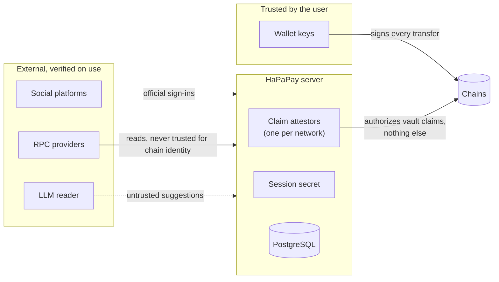

# Security model

HaPaPay moves real assets, so its design starts from what must never happen: the service must never be able to spend
a user's money, pay someone the user did not review, or record a payment that did not happen. This document lists the
trust boundaries, the controls behind each one, and the risks that remain.

To report a vulnerability, follow [SECURITY.md](../SECURITY.md).

## Trust boundaries



| Actor | Can | Cannot |
|---|---|---|
| **User wallet** | Sign payments, vault deposits, claims and refunds | Be signed for by anyone else |
| **Server** | Prepare transactions, read chains, record verified receipts, issue claim attestations | Hold user keys, sign or broadcast a user's transfer, move funds out of a vault on its own |
| **Claim attestor** | Authorize the claim of an open vault payment on its network; the server issues one only to the wallet that proved the identity | Claim after the expiry, refund, or touch direct payments |
| **Contract owner** | Rotate the verifier (and through it authorize claims), transfer ownership, set the holder rate, name the burn token, choose burn-vault swaps | Change the fee constants, refund someone else's link, pause users |
| **LLM reader** | Suggest a structured reading of a message | Authorize anything; its output is kept only where the message itself says the same thing |

## Controls

### Custody and signing

- The server never stores, receives or derives user keys. Privy's embedded wallets stay with Privy; an embedded
  wallet can be exported only through Privy's own window, and the desk never sees a key.
- The only keys the server signs anything for a chain with are the claim attestors, one per network; the session secret
  signs wallet sessions, which never reach a chain. It also holds the Arc identity registry's attestor keys, only to
  derive that registry's verifier address. A mainnet attestor key equal to another
  attestor key is refused at boot, and the Solana attestor must also differ from the operator and the treasury.
- Admin actions are signed by an admin wallet: the server writes a one-time, five-minute message that names the
  change and the SHA-256 of its exact payload, and logs the message and signature before the change runs.

### What the user reviews is what the wallet signs

- A draft is a description. Preparation resolves the recipient again and answers `409` if it changed.
- Before a wallet opens, the server checks balances and allowances, and on Robinhood Chain and Solana simulates the
  transaction, so issuer pauses, compliance blocks and short balances are reported in words. Arc payments and Arc
  claims are checked but not simulated.
- The browser rebuilds every prepared call from the review and compares it byte for byte: chain ID, token,
  sender, recipient, amount, fee (at most 1%, splitting as the contract does), note and, on Solana, compute limits and
  priority fees. Any difference keeps the wallet closed.
- Wallet network entries (chain ID, RPC, explorer) come from bundled constants, never from a server response.

### Records come from chains

- A payment is recorded only when the receipt succeeded, was sent by the session wallet, and contains the exact token
  `Transfer` logs (and the router's `Paid` event); a Solana payment only when the confirmed transaction moved exactly
  the reviewed units to each recipient and the fee to the treasury.
- Transaction hashes are never proof by themselves, and every record is keyed so that a replay answers `409`.
- A vault link is recorded only from the escrow's exact `PaymentCreated` event, or the program account holding exactly
  the reviewed values.

### Identity

- Accounts are linked only through official flows: GitHub OAuth, X OAuth 2.0 with S256 PKCE, Log in with Telegram
  (HMAC), Discord OAuth `identify`, and Sign in with Farcaster (nonce, domain, signature and FID checks).
- One provider identity belongs to one wallet at a time; a handle belongs to one provider identity.
- Wallet sessions are EIP-4361 sign-ins for the site's own domain and origin, single-use and valid five minutes; the
  session cookie is HttpOnly, SameSite=Lax and Secure in production.
- An account's Solana address, where Solana payments to its handles arrive, changes only with the wallet's consent:
  within ten minutes of the account's own sign-in, or with a fresh signature from the account wallet.
- Links that wait for a name can be claimed only by an account whose platform confirmed that name after the link was
  made; on Discord and X the account must also be older than the link.

### Assets and contracts

- Assets are committed allowlists, pinned by address or mint and read back from chain by the sync scripts. Live price
  or registry data never adds an asset or changes an address.
- Every network is verified at boot by chain ID or genesis hash, and a mismatch turns that network off.
- Contracts and the Solana program are accepted only when their deployed code hashes to the committed artifacts and
  their owner, verifier, treasury and fee settings match; the checks run again before new vault funding.
- Funding, claims and refunds require exact balance changes, so fee-on-transfer and under-delivering tokens fail closed.

### Contract properties covered by tests

- Claim attestations bind chain ID, escrow, payment ID, identity key, token, recipient, amount, expiry and a deadline
  at most ten minutes away; low-`s` and strict-`v` checks reject malleable signatures.
- Only the attested recipient can submit a claim, up to and including the expiry; only the payer can refund, and only
  after it.
- A funded payment ID is tombstoned forever, so it cannot be funded twice.
- Every external token call is guarded against reentrancy.

### Application hardening

- Strict Content Security Policy without `unsafe-eval`, `frame-ancestors 'none'`, `no-referrer`, `nosniff`, and
  `no-store` on every API response.
- Rate limits on every route that prepares, records or signs in; on Vercel, client keys come only from the
  platform-overwritten forwarding header, and anything malformed is refused before protected handlers.
- Fixed error messages: provider, database and RPC error text, RPC URLs and secrets never reach the browser or logs.
- Secrets are server-side only; nothing secret is exposed through `VITE_` variables.
- Append-only tables (the SP ledger and rules, the audit log, invite records) refuse `UPDATE`, `DELETE` and
  `TRUNCATE` at the database level.
- Requests never alter the schema; migrations are explicit and the server refuses to serve an incompatible schema.

## Known limitations

1. **No independent audit.** The contracts and the program are covered by unit, fuzz and invariant tests and by
   Slither, which is local evidence only. Use small amounts.
2. **Powerful operator roles.** Owners and verifiers can rotate keys and transfer ownership in one step; production
   should use separated keys, a multisig owner and monitoring of ownership and verifier events. Contracts have no pause.
3. **Attestor compromise.** A stolen attestor key could authorize claims of every open vault link on its network to
   any wallet; it cannot touch direct payments or links already settled. The same holds for an owner who rotates the
   verifier to their own key. Keys belong in a secrets manager and are rotated through the contracts' `setVerifier`.
4. **Database integrity.** Identity links live in PostgreSQL. Whoever can write that database can change who a handle
   resolves to for future payments. Production databases need restricted credentials, backups and monitoring.
5. **Stateless sessions.** A session lasts 30 days from its signature and cannot be revoked one by one; rotating the
   session secret signs everyone out. A copied cookie can act for its wallet until it expires, but cannot move funds.
6. **Name locks.** A link that waits for a name is claimed by whoever holds that name when they connect. A name given
   up during the window can be claimed by another existing account (on Telegram, by any account), and a misspelt name
   waits for whoever has that spelling. The review says so before funding.
7. **Eligibility.** Stock Token and xStocks transfers ask for a self-attestation of eligibility, not KYC. The issuers'
   on-chain pause and compliance lists remain authoritative.
8. **Upgradeable Solana program.** The operator keeps the upgrade authority so the program can be closed. The server
   re-reads the deployed code before every vault action, but users must trust the operator not to replace it between
   those reads.
9. **Rate limits are per instance.** On serverless platforms they are not global abuse protection.
10. **Price feeds value rewards.** Stock Token and xStock payments are valued at the Robinhood and Jupiter quotes for SP
    and for the USDC invite rewards an admin pays out, so a wrong or manipulated quote inflates both. Daily caps and
    the admin's review before a payout are the only bounds.

## Running the security checks

```bash
npm run test:contracts   # contract compilation, artifacts and lifecycles on a local chain
npm run test:forge       # Forge unit, fuzz and invariant suites
npm run test:slither     # Slither, failing on medium or higher findings
npm test                 # the full application suite
npm audit --audit-level=high
```
