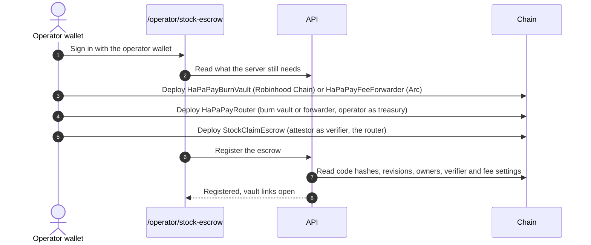

# Self-hosting

This guide takes a HaPaPay deployment from an empty machine to a production setup. Everything is configured through
environment variables; [`.env.example`](../.env.example) lists them all with comments. Values are never needed in
code, and none should ever be committed.

## 1. Run it locally

```bash
npm ci
cp .env.example .env
npm run dev
```

- The desk runs on `http://localhost:5173` and the API on `http://localhost:8787` (Vite proxies `/api`).
- Without `DATABASE_URL`, development uses in-memory stores. Production refuses to start without PostgreSQL.
- Every network and platform without settings shows as locked, with the reason; nothing else breaks.

`npm run readiness` checks the session secret, the database, the sign-in apps, the Farcaster RPC and the OpenRouter and
X keys, verifies the Arc network and contracts on chain, and prints missing settings by name only. It does not check
`APP_URL`, `APP_DOMAIN` or `PRIVY_APP_ID`, and it lists the optional OpenRouter and X keys as missing; the network
settings below are reported by `/api/health` and the operator page.

## 2. Core settings

| Variable | Required | Purpose |
|---|---|---|
| `APP_URL`, `APP_DOMAIN` | Production | The site's HTTPS origin and its bare host name. OAuth callbacks, wallet sign-ins and cookies are bound to it. |
| `SESSION_SECRET` | Production | Your own random value (`openssl rand -hex 32`); signs the 30-day wallet sessions. Production refuses the template's placeholder. Rotating it signs everyone out. |
| `DATABASE_URL` | Production | PostgreSQL connection string (Neon and plain PostgreSQL both work). |
| `FARCASTER_OPTIMISM_RPC_URL` | Production | An Optimism RPC for Sign in with Farcaster's smart-account checks; production refuses to start without it. |
| `PRIVY_APP_ID` | Optional | One sign-in (email, social or wallet) with an EVM and a Solana wallet. Allow your origin in Privy's dashboard. |
| `OPENROUTER_API_KEY`, `OPENROUTER_MODEL` | Optional | The optional model reader, asked when the rules find no recipient or for a USDC request in free form. Those messages go to OpenRouter. Without it, the deterministic reader handles everything. |
| `ADMIN_WALLET_ADDRESSES` | Optional | Comma-separated EVM addresses allowed into `/admin`, in addition to the operator wallets. |
| `CRON_SECRET` | Optional | Lets the daily cron award missing SP; without it the cron route stays closed. |
| `TRUST_PROXY` | Docker behind a proxy | The proxies in front of the server: a hop count (`1`) or their addresses (IPs, CIDR ranges no broader than /8, or /16 for IPv6, or `loopback`, `linklocal`, `uniquelocal`). Rate limits count clients by the address it yields. Never `true`. |

## 3. Database

Migrations are explicit and never run at request time:

```bash
DATABASE_URL=postgres://… npm run migrate:database          # apply
DATABASE_URL=postgres://… npm run migrate:database -- --check-only # verify only
```

Behind a network that blocks PostgreSQL's port, add `--transport=neon-http` to run the same statements over Neon's HTTPS
endpoint. Run migrations before the first deploy and before every release that changes the schema. In production the
server checks every migration-defined table and column, the primary and unique keys, the ledger's kind check, the invite
pair index and the append-only triggers at boot (read-only), and refuses a schema that does not match: on Vercel it
answers `503`, and a container does not start. A development server with a database applies the migrations itself. The
SP ledger, the rule versions, the admin audit log and the invite tables only grow; use a database plan whose restore
window covers the time you need, and export the SP ledger, the rule versions and the audit log from the admin panel's
Data section.

## 4. Social platforms

Register one app per platform, with callbacks on your own origin:

| Platform | Variables | Callback or setting |
|---|---|---|
| GitHub | `GITHUB_CLIENT_ID`, `GITHUB_CLIENT_SECRET`; optional `GITHUB_API_TOKEN` (read-only, for lookups above the public rate limit) | `https://<your-domain>/api/oauth/github/callback` |
| X | `X_CLIENT_ID`, `X_CLIENT_SECRET`; `X_API_BEARER_TOKEN` for X vault links that wait for the account | `https://<your-domain>/api/oauth/x/callback` |
| Discord | `DISCORD_CLIENT_ID`, `DISCORD_CLIENT_SECRET` | `https://<your-domain>/api/oauth/discord/callback` |
| Telegram | `TELEGRAM_BOT_TOKEN`, `TELEGRAM_BOT_USERNAME` | Set the bot's domain to your host with BotFather's `/setdomain` |
| Farcaster | `FARCASTER_OPTIMISM_RPC_URL` (see core settings) | None (Sign in with Farcaster) |

If a platform refuses the site's own credentials, the desk says so as a site setting, not as the user's fault, and
`/api/health` reports which lookups are being refused.

## 5. Networks

Each network is switched on by its settings and verified at boot (chain ID or genesis hash). Provider RPC URLs may carry
a key; they stay on the server and fall back to the public endpoint.

### Robinhood Chain

| Variable | Purpose |
|---|---|
| `ROBINHOOD_MAINNET_STOCK_TRANSFERS=enabled` | Turns on mainnet Stock Token transfers and Stock Token vault links. Leave it off until you have reviewed eligibility for your users. |
| `ROBINHOOD_MAINNET_TOKEN_TRANSFERS` | USDG; on unless set to `disabled`. |
| `ROBINHOOD_TESTNET_STOCK_TRANSFERS`, `ROBINHOOD_TESTNET_TOKEN_TRANSFERS` | Testnet faucet tokens; on unless `disabled`. |
| `ROBINHOOD_MAINNET_RPC_URL`, `ROBINHOOD_TESTNET_RPC_URL` | Optional provider RPCs for the server. |
| `ROBINHOOD_OPERATOR_ADDRESS` | The wallet that deploys and owns the vault and fee contracts and receives the treasury half of fees. |
| `ROBINHOOD_MAINNET_CLAIM_ATTESTOR_PRIVATE_KEY` | A new key, used for nothing else, that signs mainnet vault claims. |
| `ROBINHOOD_TESTNET_CLAIM_ATTESTOR_PRIVATE_KEY` | Testnet claim attestor (may fall back to `CLAIM_ATTESTOR_PRIVATE_KEY`). |

### Solana

| Variable | Purpose |
|---|---|
| `SOLANA_TREASURY_ADDRESS` | Receives the whole 1% fee on Solana. Solana payments stay off without it. |
| `SOLANA_TRANSFERS` | USDC and USDG; on unless `disabled`. |
| `SOLANA_STOCK_TRANSFERS=enabled` | xStocks; off until enabled after your eligibility review. |
| `SOLANA_RPC_URL` | Optional provider RPC for the server; the public endpoint otherwise. |
| `SOLANA_BROWSER_RPC_URL` | A QuickNode Solana mainnet endpoint for the pages (Solana's public RPC refuses browsers). Its token reaches every visitor, so restrict it to your domain in QuickNode. |
| `SOLANA_OPERATOR_ADDRESS` | The Solana address (added to the operator's account) that deploys the vault program. |
| `SOLANA_CLAIM_ATTESTOR_PRIVATE_KEY` | A new ed25519 key for program claims (`npm run init:solana-attestor`). |

### Arc

| Variable | Purpose |
|---|---|
| `ARC_NETWORK_MODE` | `testnet` (default) or `mainnet`. Mainnet uses bundled official parameters. |
| `ARC_MAINNET_RPC_URL` | Optional provider RPC for the server's reads. |
| `ARC_MAINNET_OPERATOR_ADDRESS` | Arc's operator wallet (falls back to `ROBINHOOD_OPERATOR_ADDRESS`). |
| `ARC_MAINNET_IDENTITY_ATTESTOR_PRIVATE_KEY`, `ARC_MAINNET_CLAIM_ATTESTOR_PRIVATE_KEY` | Two new keys just for Arc Mainnet (`npm run init:arc-mainnet` writes them to a local folder, never to the console). |
| `ARC_MAINNET_IDENTITY_REGISTRY_ADDRESS`, `ARC_MAINNET_CLAIM_ESCROW_ADDRESS` | Set after the operator page deploys and verifies the four Arc contracts. |
| `ARC_IDENTITY_REGISTRY_ADDRESS`, `ARC_CLAIM_ESCROW_ADDRESS`, `CLAIM_ATTESTOR_PRIVATE_KEY`, `IDENTITY_ATTESTOR_PRIVATE_KEY`, `CONTRACT_OWNER_ADDRESS` | Arc Testnet equivalents. `npm run init:testnet-env` writes a new `.env` from the template with fresh testnet keys; run it instead of copying the template, as it never overwrites an existing `.env`. |

Give every mainnet attestor its own key: the server refuses a mainnet attestor key equal to another attestor key,
and a Solana attestor that is the operator's or the treasury's. The testnets may share one.

## 6. Operator setup

Contracts and the Solana program are deployed by the operator's own wallet from `/operator/stock-escrow`, using the
artifacts committed in this repository. Nothing is deployed from a command line with a private key.



- **Robinhood Chain**: three signatures (burn vault, router, escrow), then registration. The page resumes after an
  interruption and never pays for a contract twice.
- **Solana**: the page checks the pinned program's SHA-256, funds a temporary deployment key with one approval,
  writes the buffer, deploys, writes the settings (owner, verifier, treasury) and hands the upgrade authority to the
  operator, then registers the program. The program can later be retired and closed from the same page once it holds
  no links.
- **Arc Mainnet**: four contracts from the Arc card, a read-only verification, then set the two addresses and
  `ARC_NETWORK_MODE=mainnet` and redeploy.

On Robinhood Chain and Arc Mainnet, fees start when the network's contracts are registered: until then Robinhood Chain
sends plain transfers without a fee, and Arc Mainnet payments wait for verified fee contracts. Solana charges its fee
to `SOLANA_TREASURY_ADDRESS` from the first payment.

To name the token the Robinhood Chain burn vault buys and burns, the owner calls `setBurnToken(token)` once. Until
then the burn half of fees stays in the vault.

## 7. Deploy

### Vercel

The repository is ready for a Vercel project:

- `vercel.json` serves the desk from the CDN with its Content Security Policy and routes `/api/*` to the Express
  function in `server.ts`, in the `fra1` region, with a daily cron for SP.
- `npm run build:vercel` builds the desk and stages it for the CDN.
- The committed `vercel.json` disables automatic production deployments of `main` (`git.deploymentEnabled`), so a
  release is promoted deliberately. Remove that block if you prefer automatic deployments.
- If you use Privy, Telegram or a provider RPC on other hosts, keep the CSP in `vercel.json` in step with
  `CONNECT_SOURCES` and `FRAME_SOURCES` in `server/app.ts`.

### Docker

```bash
docker build -t hapapay .
docker run --env-file .env -p 8787:8787 hapapay
```

The image runs as a non-root user, serves the built desk and the API on port 8787, and checks `/api/health`. It checks
the database schema at boot and does not start until it matches, so apply the migrations from your checkout first
([section 3](#3-database)). Put it behind a TLS reverse proxy (production needs an HTTPS `APP_URL`) and set
`TRUST_PROXY` to that proxy (for example `1`), so rate limits count each client rather than the proxy.

## 8. Production checklist

- [ ] HTTPS origin set in `APP_URL` and `APP_DOMAIN`; OAuth callbacks registered on it
- [ ] `SESSION_SECRET` generated (`openssl rand -hex 32`) and stored as a secret
- [ ] `FARCASTER_OPTIMISM_RPC_URL` set; `TRUST_PROXY` set when a reverse proxy sits in front of a container
- [ ] PostgreSQL provisioned, migrated, and backed up
- [ ] Every attestor key generated for its role only, stored as a sensitive value
- [ ] Contracts and the Solana program deployed from the operator page and registered
- [ ] Stock Token and xStocks switches turned on only after an eligibility review
- [ ] `SOLANA_BROWSER_RPC_URL` restricted to your domain at the provider
- [ ] Admin wallets set, and the audit log exported on a schedule
- [ ] `npm run readiness`, `/api/health` and `/api/providers` show what you expect
